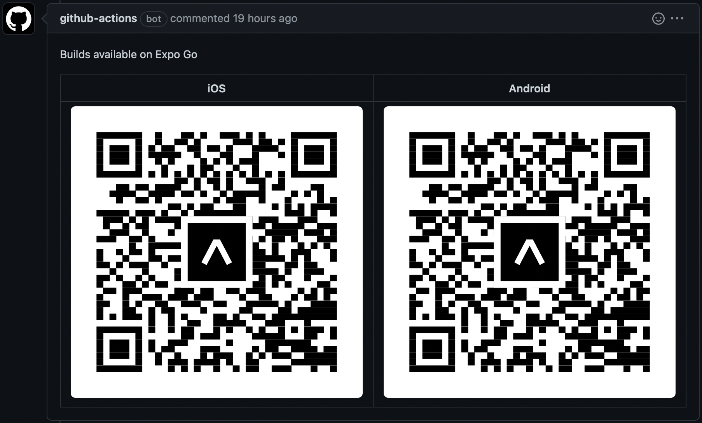

# EAS Update - QR Code Commenter

On Pull Requests, adds a comment with QR codes that link to the Expo Go App and into the respective Update.

I created this to mimic the flow of the [Expo Preview Comment Action](https://github.com/expo/expo-github-action) except instead create QR codes for `eas update` rather than `expo publish`.

Because it was a nuisance to figure out, here is an action to save you the mental journey I have been through.

## Inputs

|name|required|description|
|-|-|-|
|`repo-token`|true|Github Token used to publish comment|
|`ios-build-id`|true|iOS Build ID generated from `eas update`|
|`android-build-id`|true|Android Build ID generated from `eas update`|
|`comment-title`|false|Title of the comment|

## Example usage

```yml
uses: matthewmcintyre/eas-update-qr-commenter@v2.0
with:
  repo-token: "${{ secrets.GITHUB_TOKEN }}"
  ios-build-id: "build id generated from expo update"
  android-build-id: "build id generated from expo update"
  comment-title: 
```

## Example Output



## Integration into Actions workflow

```yml
- name: Publish update
  id: eas-publish-update
  run: |
    { 
      echo 'EAS_UPDATE_OUTPUT<<EOF'
      eas update --branch "${{ env.BRANCH_NAME }}" --message "${{ env.COMMIT_MESSAGE }}" --json
      echo 'EOF'
    } >> "$GITHUB_ENV"

- name: Add QR Code
  uses: matthewmcintyre/eas-update-qr-commenter@v2.0
  with:
    ios-build-id: '${{ fromJSON(env.EAS_UPDATE_OUTPUT)[1].id }}'
    android-build-id: '${{ fromJSON(env.EAS_UPDATE_OUTPUT)[0].id }}'
    repo-token: '${{ secrets.GITHUB_TOKEN }}'
```
